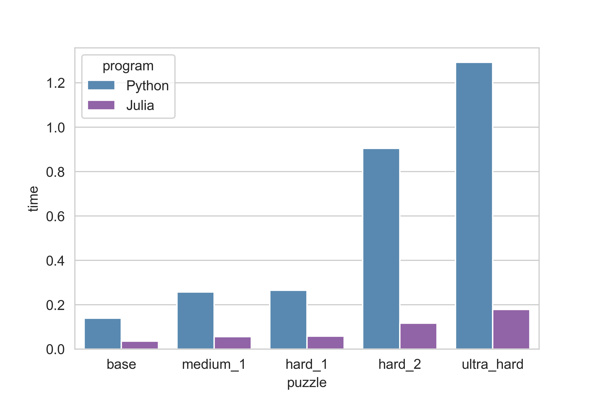

# Speed comparison between Python and Julia using a Sudoku algorithm

### Thank you to the computerphile/numberphile youtube channel, I decided to play with this problem after watching a related video of theirs, and my algorithm is very similar to theirs.

Given a sudoku board as a 9x9 matrix, theres a straightforward algorithm of solving it: it's a variant of the N-Queens backtracking algorithm with a helper function checking if theres a valid placeemnt and then instead of simply a valid placement and backtracking, it iterates through valid placements. It's faster than than brute force but there are some pretty fancy strategy based sudoku algorithms which are pretty fascinating. 

I wrote out the program in Python, and carefully wrote it out exacly the same in Julia (not too bad as they are quite similar languages). Interestingly it seems the harder sudoku puzzles for humans are also harder for computers, ie requiring more computational time. The final puzzle `ultra_hard` was written by finnish mathematician Arto Inkala and is one of the hardest Sudoku puzzles for humans to do. 

Here are the time comparisons for each puzzle.

Needless to say, Julia is much *much* faster. 
